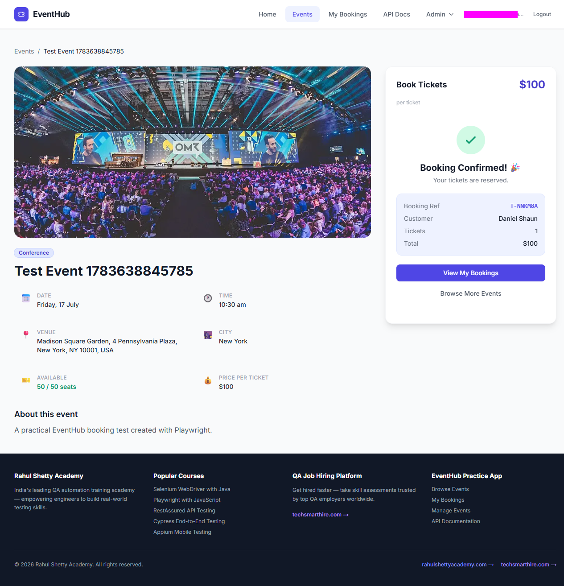
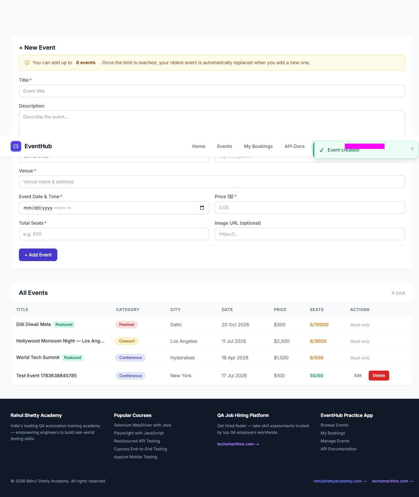
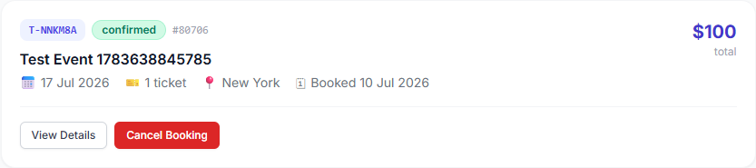
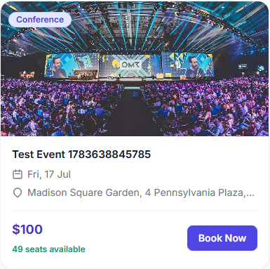
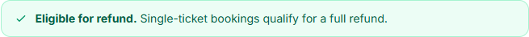
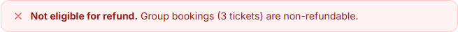

# EventHub Playwright Automation Portfolio

An end-to-end test automation project built with **Playwright** and **JavaScript**. The suite validates event administration, booking workflows, seat inventory, booking-reference rules, refund eligibility, loading states, screenshots, HTML reports, traces, and video recordings.

<p align="center">
  
</p>

## Project objective

This project demonstrates how automated browser tests can validate a complete customer journey across an event-booking application while producing visual evidence suitable for a QA portfolio.

## Video evidence

| Automated scenario | What the test validates | Recording |
|---|---|---|
| Event creation and booking | Creates a conference event, books one ticket, verifies the booking and confirms the seat count decreases | [Watch video](docs/videos/01-event-creation-seat-validation.webm) |
| Single-ticket refund | Confirms that a single-ticket booking qualifies for a full refund | [Watch video](docs/videos/02-single-ticket-refund.webm) |
| Group-booking refund | Confirms that a three-ticket group booking is non-refundable | [Watch video](docs/videos/03-group-booking-refund.webm) |

## Automated scenarios

### 1. Event creation, booking and seat inventory

- Authenticate with a valid EventHub account.
- Create a uniquely named conference event through the administration panel.
- Add a conference-stage banner image to the event.
- Locate the event using its generated title.
- Record its available seat count.
- Book one ticket.
- Verify the booking in **My Bookings**.
- Confirm that the available seat count decreases by exactly one.

### 2. Single-ticket refund eligibility

- Book the first available event with one ticket.
- Open the booking details.
- Validate the booking-reference rule.
- Confirm that the refund spinner appears and disappears.
- Verify **Eligible for refund** and the expected explanation.

### 3. Group-booking refund eligibility

- Increase the ticket quantity from one to three.
- Complete the booking and open its details.
- Validate the booking-reference rule.
- Confirm that the refund spinner appears and disappears.
- Verify **Not eligible for refund** and the expected explanation.

## Skills demonstrated

- Playwright Test with JavaScript
- End-to-end browser automation
- Reusable asynchronous helper functions
- Dynamic test-data generation
- Accessible, CSS and test-ID locators
- Assertions and explicit timeout handling
- Form automation and navigation
- Text extraction and numeric comparison
- Loading-spinner validation
- Environment-variable management
- Screenshot and video evidence
- HTML reports and traces

## Repository structure

```text
eventhub-playwright-automation-portfolio/
├── docs/
│   ├── images/
│   │   ├── 01-event-created.png
│   │   ├── 02-created-event-card-before-booking.png
│   │   ├── 03-booking-confirmation.png
│   │   ├── 04-my-bookings-card.png
│   │   ├── 05-event-card-after-booking.png
│   │   ├── 06-single-ticket-refund-result.png
│   │   └── 07-group-ticket-refund-result.png
│   └── videos/
│       ├── 01-event-creation-seat-validation.webm
│       ├── 02-single-ticket-refund.webm
│       └── 03-group-booking-refund.webm
├── tests/
│   └── Eventhub_project.spec.js
├── .env.example
├── .gitignore
├── LICENSE
├── package.json
├── playwright.config.js
└── README.md
```

## Test evidence

### Event created successfully



### Booking confirmation with conference banner


### Booking verified in My Bookings



### Seat inventory reduced from 50 to 49



### Refund-rule results

| Single-ticket booking | Three-ticket group booking |
|---|---|
|  |  |

## Video demonstrations

The recordings are stored in the repository as WebM files. The account-email areas have been covered in the public portfolio copies.

- [Event creation, booking and seat validation](docs/videos/01-event-creation-seat-validation.webm)
- [Single-ticket refund validation](docs/videos/02-single-ticket-refund.webm)
- [Three-ticket group refund validation](docs/videos/03-group-booking-refund.webm)

## Prerequisites

- Node.js 18 or later
- npm
- A valid EventHub account

## Installation

```bash
git clone https://github.com/YOUR-USERNAME/eventhub-playwright-automation-portfolio.git
cd eventhub-playwright-automation-portfolio
npm install
npx playwright install chromium
```

## Environment setup

Copy `.env.example`, rename the copy to `.env`, and enter your own test-account details:

```env
EVENTHUB_EMAIL=your-email@example.com
EVENTHUB_PASSWORD=your-password
EVENTHUB_FULL_NAME=Your Name
EVENTHUB_PHONE=+91 98765 43210
```

The `.env` file is excluded by `.gitignore` and must not be committed.

## Running the suite

### Run all three tests

```bash
npm run test:portfolio:headed
```

### PowerShell alternative

```powershell
npx.cmd playwright test Eventhub_project.spec.js --headed --workers=1
```

### Run only the event-creation test

```powershell
npx.cmd playwright test Eventhub_project.spec.js --grep "Create event" --headed --workers=1
```

### Run only the single-ticket refund test

```powershell
npx.cmd playwright test Eventhub_project.spec.js --grep "Single-ticket" --headed --workers=1
```

### Run only the group-booking refund test

```powershell
npx.cmd playwright test Eventhub_project.spec.js --grep "Three-ticket" --headed --workers=1
```

### Open the HTML report

```bash
npm run report
```

## Evidence generated during a test run

The configuration records each test at 1280 × 720 and generates:

- Video under `test-results`
- Screenshot on failure
- Trace on failure
- HTML report under `playwright-report`
- Portfolio screenshots under `docs/images`

The permanent, curated portfolio recordings are stored under `docs/videos`.

## Security and privacy

- Credentials are supplied through environment variables.
- `.env`, raw test results, traces and reports are excluded from Git.
- Public portfolio screenshots mask the account email.
- Public portfolio videos included here have the visible email regions covered.

## Conference image attribution

The event banner uses **“OMR19 Conference Stage”**, uploaded by Isame90 and credited in its metadata to Julian Huke, under the **Creative Commons Attribution-ShareAlike 4.0 International** licence:

- https://commons.wikimedia.org/wiki/File:OMR19_Conference_Stage.jpg
- https://creativecommons.org/licenses/by-sa/4.0/

## Author

**Alex Fatogun**  
Junior Software Tester building practical experience in manual testing, JavaScript and Playwright automation.
